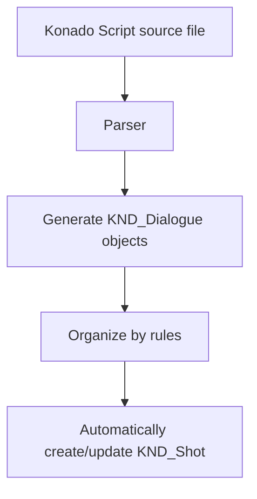

# KND_Shot and KND_Dialogue

## Preface

This chapter introduces two core Konado classes: KND_Shot and KND_Dialogue. These two classes are central to Konado and are used to represent dialogue shots and dialogues. If you want to understand Konado's architecture in depth, understanding these classes is very important. Once you fully understand them, you can extend and modify them as needed to meet your requirements.

## KND_Shot

### Definition

KND_Shot is a core Konado class used to represent a dialogue shot.

A shot is a basic concept in film and animation production. It represents a continuous picture, usually containing a series of frames. Here, the KND_Shot class represents a dialogue shot that contains a series of dialogues.

You can also understand it with a book metaphor: a shot is like a small chapter, and a dialogue shot is the dialogue inside that small chapter.

KND_Shot is responsible for organizing scattered KND_Dialogue data objects and arranging them in a certain order so they can be played in the specified order during playback.

Unlike a film shot, however, KND_Shot does not necessarily represent a continuous, linear story. It may be composed of multiple branch sections, each containing a series of dialogues, and can be combined with choice to implement multi-option branches so users can choose different dialogue paths.

### Relationship Between KND_Shot and Konado Script

During use, you will notice that KND_Shot does not normally need to be created manually. It is created automatically by Konado Script, and its data is updated automatically. This is because we use a custom Konado Script syntax and a Konado Script parser to parse script files. Lines from the source file are parsed into KND_Dialogue objects, then organized into KND_Shot objects according to specific rules.

Expressed as a flowchart, the process from Konado Script to multiple KND_Dialogue objects and then to KND_Shot is roughly:

If you want to learn more about how Konado Script is parsed, refer to the Konado Script documentation and the parser source code.
