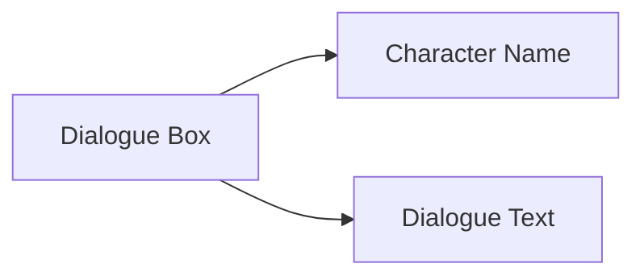

# Ordinary Dialogue

## Description


Ordinary dialogue is a common interaction method in games. It is used for communication between characters and players, presenting dialogue content through the character name and dialogue text.

## Syntax

```text
[character] [dialogue text] [voice tag]
```

## Parameters

| Parameter | Required | Example | Description |
|------|------|------|------|
| Character | Yes | `alice` | Character name used for displaying the dialogue box |
| Dialogue text | Yes | `Hello, my name is Alice!` | What the character says |
| Voice tag | No | `alice_intro_01` | Optional tag used to identify the voice file |

## Example

```text
# Ordinary dialogue
"alice" "Hello, my name is Alice!" alice_intro_01

# Narration (no character)
"narrator" "The storm was growing stronger..."
```
