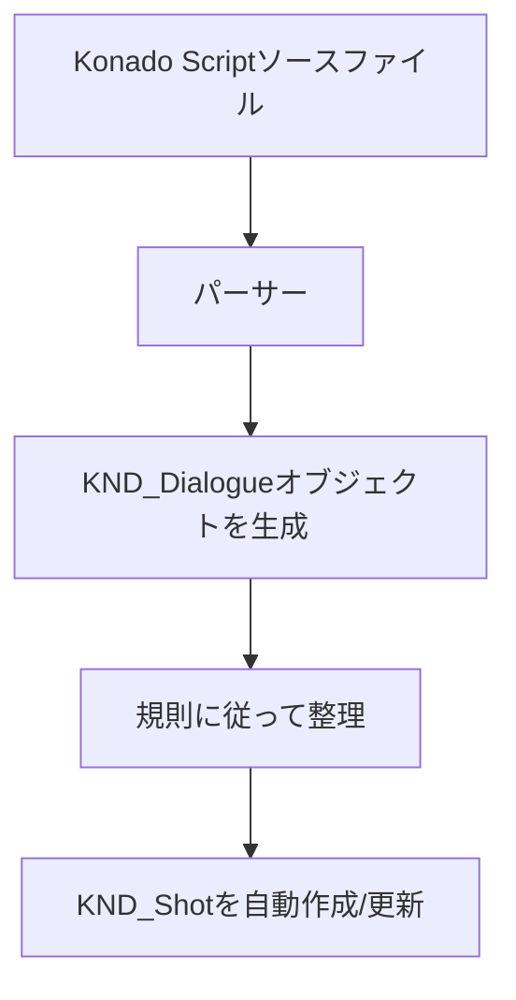

# KND_Shot と KND_Dialogue

## はじめに

この章では、Konado の 2 つのコアクラスである KND_Shot と KND_Dialogue を紹介します。これらは Konado の中心となるクラスで、会話ショットと会話を表します。Konado のアーキテクチャを深く理解したい場合、この 2 つのクラスを理解することは非常に重要です。十分に理解したうえで、必要に応じて拡張や変更を行えます。

## KND_Shot

### 定義

KND_Shot は Konado のコアクラスであり、1 つの会話ショットを表します。

ショットは映像やアニメーション制作における基本概念で、連続した画面を表し、通常は一連のフレームを含みます。ここでは、KND_Shot クラスは一連の会話を含む会話ショットを表します。

本にたとえるなら、ショットは小さな章であり、会話ショットはその小さな章の中の会話です。

KND_Shot は、散らばった KND_Dialogue データオブジェクトを整理し、一定の順序で並べることで、再生時に指定された順序どおりに再生できるようにします。

ただし映画のショットとは異なり、KND_Shot は必ずしも連続した線形ストーリーを表すわけではありません。複数の branch 分岐で構成される場合があり、それぞれの分岐が一連の会話を含み、choice と組み合わせることで複数選択の分岐を実現し、ユーザーに異なる会話経路を選ばせることができます。

### KND_Shot と Konado Script の関係

使用していると分かるように、通常 KND_Shot を手動で作成する必要はありません。Konado Script によって自動的に作成され、データも自動更新されます。これは、独自の Konado Script 構文と Konado Script パーサーを使用してスクリプトファイルを解析し、ソースファイルの各行を KND_Dialogue オブジェクトに変換し、一定の規則に従って KND_Shot オブジェクトへ整理するためです。

フローチャートで表すと、Konado Script から複数の KND_Dialogue を経て KND_Shot へ至る流れはおおよそ次のようになります。

Konado Script の解析過程について詳しく知りたい場合は、Konado Script の関連ドキュメントとパーサーのソースコードを参照してください。
