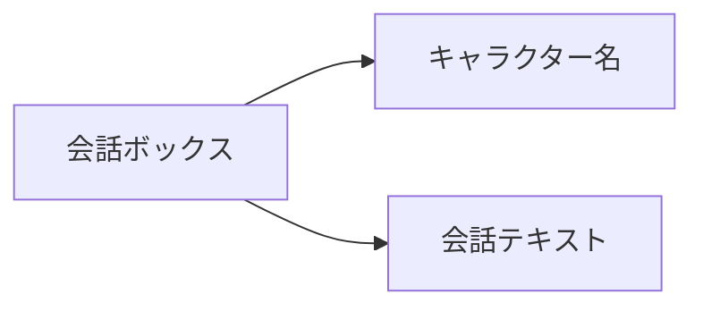

# 通常会話

## 機能説明


通常会話は、ゲームでよく使われるインタラクション方式です。キャラクターとプレイヤーのやり取りに使われ、キャラクター名と会話テキストによって会話内容を表示します。

## 構文

```text
[キャラクター] [会話テキスト] [ボイスタグ]
```

## パラメーター

| パラメーター | 必須 | 例 | 説明 |
|------|------|------|------|
| キャラクター | はい | `alice` | 会話ボックスに表示するキャラクター名 |
| 会話テキスト | はい | `こんにちは、私はアリスです！` | キャラクターが話す内容 |
| ボイスタグ | いいえ | `alice_intro_01` | ボイスファイルを識別するための任意タグ |

## 例

```text
# 通常会話
"alice" "こんにちは、私はアリスです！" alice_intro_01

# ナレーション（キャラクターなし）
"narrator" "嵐はますます激しくなっていた..."
```
