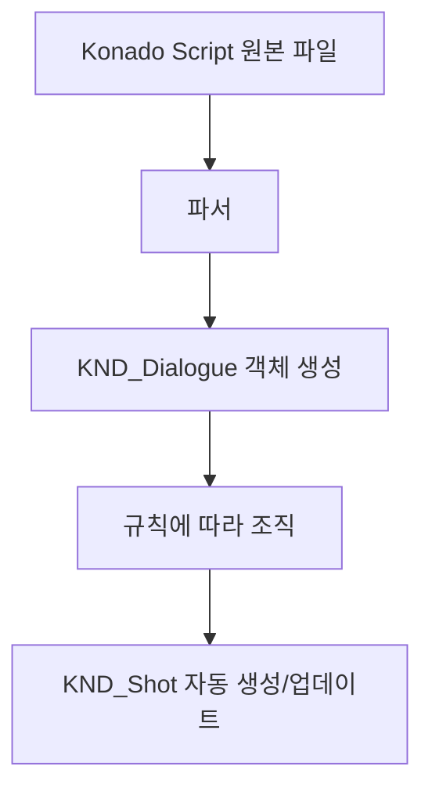

# KND_Shot 및 KND_Dialogue

## 머리말

이 장에서는 Konado의 두 핵심 클래스인 KND_Shot과 KND_Dialogue를 소개합니다. 이 두 클래스는 Konado의 핵심이며 대화 샷과 대화를 나타내는 데 사용됩니다. Konado의 아키텍처 원리를 깊이 이해하려면 이 두 클래스를 이해하는 것이 매우 중요합니다. 충분히 이해한 뒤에는 필요에 따라 확장하고 수정할 수 있습니다.

## KND_Shot

### 정의

KND_Shot은 하나의 대화 샷을 나타내는 Konado의 핵심 클래스입니다.

샷은 영상과 애니메이션 제작의 기본 개념으로, 보통 여러 프레임으로 이루어진 연속 화면을 의미합니다. 여기서 KND_Shot 클래스는 일련의 대화를 포함한 대화 샷을 나타냅니다.

책의 개념으로 이해할 수도 있습니다. 하나의 샷은 작은 장이고, 대화 샷은 그 작은 장 안의 대화입니다.

KND_Shot은 흩어져 있는 KND_Dialogue 데이터 객체를 조직하고 일정한 순서로 배열하여, 재생 시 지정된 순서대로 재생될 수 있게 합니다.

다만 영화의 샷과 달리 KND_Shot은 반드시 연속적이고 선형적인 이야기를 의미하지 않습니다. 여러 branch 분기로 구성될 수 있으며, 각 분기는 일련의 대화를 포함하고 choice와 조합되어 다중 선택 분기를 구현해 사용자가 서로 다른 대화 경로를 선택할 수 있게 합니다.

### KND_Shot과 Konado Script의 관계

사용하다 보면 기본적으로 KND_Shot을 수동으로 만들 필요가 없다는 점을 알 수 있습니다. KND_Shot은 Konado Script가 자동으로 만들고 데이터를 자동으로 업데이트합니다. 이는 사용자 지정 Konado Script 문법과 Konado Script 파서를 사용해 스크립트 파일을 파싱하고, 원본 파일의 각 줄을 KND_Dialogue 객체로 변환한 다음 일정한 규칙에 따라 KND_Shot 객체로 조직하기 때문입니다.

흐름도로 표현하면 Konado Script에서 여러 KND_Dialogue를 거쳐 KND_Shot으로 가는 과정은 대략 다음과 같습니다.

Konado Script의 파싱 과정을 자세히 알고 싶다면 Konado Script 관련 문서와 파서 소스 코드를 참고하세요.
