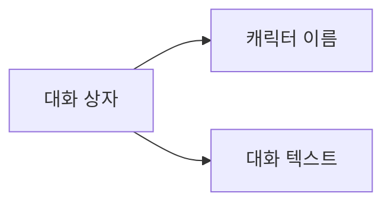

# 일반 대화

## 기능 설명


일반 대화는 게임에서 자주 쓰이는 상호작용 방식입니다. 캐릭터와 플레이어 사이의 소통에 사용되며, 캐릭터 이름과 대화 텍스트를 통해 대화 내용을 표시합니다.

## 문법 구조

```text
[캐릭터] [대화 텍스트] [음성 태그]
```

## 매개변수 설명

| 매개변수 | 필수 | 예시 | 설명 |
|------|------|------|------|
| 캐릭터 | 예 | `alice` | 대화 상자에 표시할 캐릭터 이름 |
| 대화 텍스트 | 예 | `안녕, 내 이름은 앨리스야!` | 캐릭터가 말할 내용 |
| 음성 태그 | 아니요 | `alice_intro_01` | 음성 파일을 식별하는 선택 태그 |

## 예시

```text
# 일반 대화
"alice" "안녕, 내 이름은 앨리스야!" alice_intro_01

# 내레이션(캐릭터 없음)
"narrator" "폭풍우가 점점 더 거세지고 있었다..."
```
