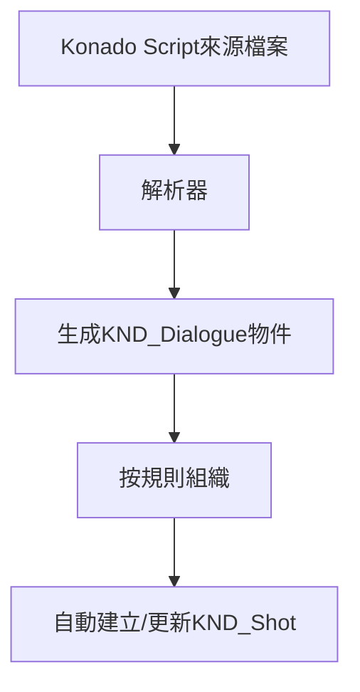

# KND_Shot 以及 KND_Dialogue

## 前言

本章節將介紹 Konado 的兩個核心類別：KND_Shot 和 KND_Dialogue。這兩個類別是 Konado 的核心，用於表示對話鏡頭與對話。如果你希望深入了解 Konado 的架構原理，理解這兩個類別非常重要。在充分理解這兩個類別的基礎上，你可以根據自身需求對它們進行擴充與修改。

## KND_Shot

### 定義

KND_Shot 是 Konado 的一個核心類別，用於表示一個對話鏡頭。

鏡頭是影視與動畫製作中的基本概念，表示一段連續畫面，通常包含一系列影格。在這裡，KND_Shot 類別用於表示一個對話鏡頭，其中包含一系列對話。

也可以用書本的概念來理解：一個鏡頭就是一個小章節，而一個對話鏡頭就是小章節中的對話。

KND_Shot 負責組織零散的 KND_Dialogue 資料物件，並按照一定順序排列它們，以便播放時能依照指定順序播放。

當然，與電影鏡頭不同，KND_Shot 不一定表示連續、線性的故事，而是可能由多個 branch 分支組成。每個分支都包含一系列對話，並搭配 choice 實作多選分支，讓使用者選擇不同的對話路徑。

### KND_Shot 與 Konado Script 的關係

在使用過程中你不難發現，預設情況下 KND_Shot 不需要手動建立，而是由 Konado Script 自動建立並自動更新資料。這是因為我們採用了自訂的 Konado Script 語法，並使用 Konado Script 解析器解析腳本檔案，將來源檔案的行解析為 KND_Dialogue 物件，然後依照一定規則組織成 KND_Shot 物件。

如果用流程圖表示，從 Konado Script 到多個 KND_Dialogue，再到 KND_Shot 的過程大致如下：

如果你想詳細了解 Konado Script 的解析過程，可以參考 Konado Script 的相關文件以及解析器原始碼。
