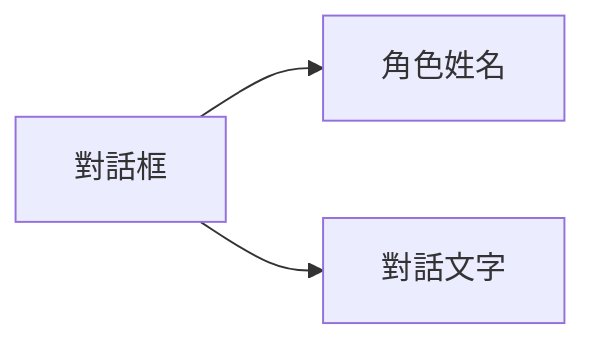

# 普通對話

## 功能描述


普通對話是遊戲中常見的互動方式，用於角色與玩家之間的交流，透過角色名稱、對話文字來呈現對話內容。

## 語法結構

```text
[角色] [對話文字] [配音標籤]
```

## 參數說明

| 參數 | 必需 | 範例 | 說明 |
|------|------|------|------|
| 角色 | 是 | `alice` | 角色名稱，用於顯示對話框 |
| 對話文字 | 是 | `你好，我叫愛麗絲！` | 角色要說的話 |
| 配音標籤 | 否 | `alice_intro_01` | 可選標籤，用於識別配音檔案 |

## 範例

```text
# 普通對話
"alice" "你好，我叫愛麗絲！" alice_intro_01

# 旁白（無角色）
"narrator" "暴風雨越來越猛烈了..."
```
