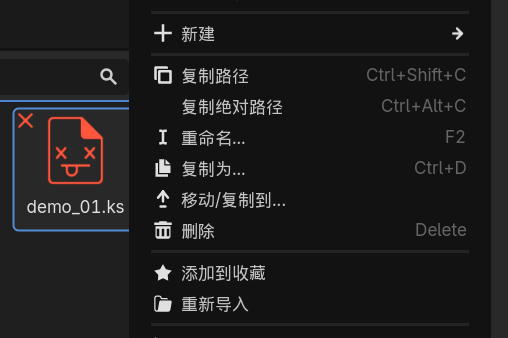

# Konado Scripts

Konado Scripts 是一种为视觉小说量身定制的创作语言（文件后缀为 .ks）。

你可以把它想象成一种更强大、更结构化的“小说剧本”：开发者无需编写复杂代码，就能控制剧情对话、角色立绘、背景切换、音乐音效，以及故事分支和选项。

## 设计理念

Konado Script 的核心设计理念是将**故事内容**与**程序逻辑**分离：
- 编剧专注于叙事内容，无需编程知识
- 程序员专注于引擎开发，无需介入故事创作
- 资源管理（图片、音频）通过标识符引用，与脚本解耦
- 模块化指令集，易于扩展新功能
- 兼容版本控制系统（Git等）
- 文本格式天生跨平台
- 资源引用与平台无关


## 常见问题

### 1. 解析失败后保存无法触发重新解析

控制台会提示错误信息，但保存后不会自动重新解析，这个是由于未成功触发重新导入导致的。

```text
第5行内容：a1ctor show 可娜 正常 at 2 5 scale 0.3
  ERROR: core/variant/variant_utility.cpp:1024 - 错误：res://sample/demo/demo_01.ks [行：5] 解析失败：无法识别的语法，终止解析: a1ctor show 可娜 正常 at 2 5 scale 0.3 
  ERROR: Failed to process scripts
  ERROR: Error importing 'res://sample/demo/demo_01.ks'.
  ERROR: Failed loading resource: res://sample/demo/demo_01.ks.

```

找到对应的脚本文件，右键选择重新导入即可。



### 2. 脚本文件编码问题

确保脚本文件编码为UTF-8，否则可能出现乱码，默认情况下创建的脚本文件编码为UTF-8。

